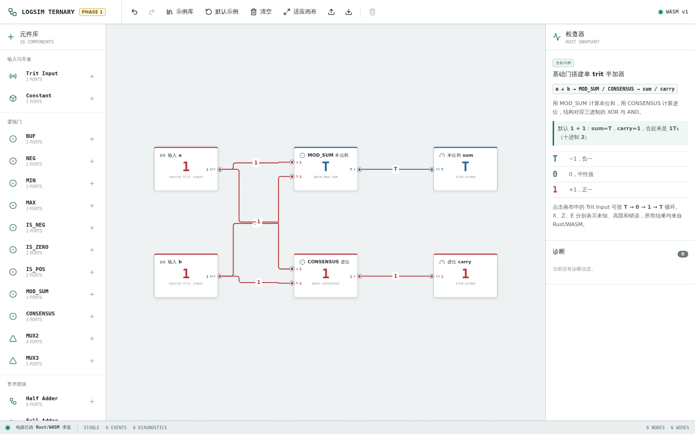

# Logsim Ternary

Logsim Ternary 是一个以 Rust/WebAssembly 为仿真内核、在浏览器中编辑和观察原生平衡三进制组合逻辑电路的工具。



## 前置环境

- Rust stable，包含 `rustfmt`、`clippy` 和 `wasm32-unknown-unknown` target。
- [`wasm-pack`](https://rustwasm.github.io/wasm-pack/) 0.15 或兼容版本。
- Node.js 24 和 npm 10 或兼容版本。
- Chromium；仅运行浏览器端验收测试时需要，可由 Playwright 自动安装。

## 第一阶段能力

- 从元件库拖放或点击添加三进制门，连接输出端与输入端并实时求值。
- 使用字符和颜色同时显示 `T/0/1/X/Z/E`，查看真值表和结构化诊断。
- 撤销、重做、删除、清空、适应画布，并载入八个可编辑教学示例。
- 导入和导出版本化 `logsim-ternary` JSON 工程文件。
- 在桌面三栏工作台和窄屏抽屉布局中编辑同一电路。

从仓库根目录安装 Rust 组件、WASM 工具和 Web 依赖：

```bash
rustup toolchain install stable --profile minimal --component rustfmt clippy --target wasm32-unknown-unknown
cargo install wasm-pack --locked
npm ci --prefix apps/web
```

## 构建

构建 Rust workspace：

```bash
cargo build --workspace
```

构建可部署的 Web 应用：

```bash
npm --prefix apps/web run build
```

Web 构建脚本会先把 `crates/sim-wasm` 编译到 `apps/web/src/wasm/pkg`，再运行 TypeScript 检查和 Vite 生产构建；输出位于 `apps/web/dist`。

## 测试

完整检查与 CI 使用同一组命令：

```bash
cargo fmt --all -- --check
cargo clippy --workspace --all-targets -- -D warnings
cargo test --workspace
wasm-pack test --node crates/sim-wasm
npm ci --prefix apps/web
npm --prefix apps/web test
npm --prefix apps/web run build
npm --prefix apps/web exec -- playwright install --with-deps chromium
npm --prefix apps/web run test:e2e
```

## 本地运行

```bash
npm ci --prefix apps/web
npm --prefix apps/web run dev
```

开发服务器默认位于 <http://localhost:5173/>。`dev` 脚本会在启动 Vite 前重新构建 WASM 包。

## 六状态信号

每条导线只承载一个 trit。`T/0/1` 是平衡三进制的三个已知值，`X/Z/E` 用于表达仿真状态：

| 状态 | 含义 |
|---|---|
| `T` | 已知值 `-1` |
| `0` | 已知值 `0` |
| `1` | 已知值 `+1` |
| `X` | 未知值；输入无法确定时使用 |
| `Z` | 高阻或当前没有有效驱动 |
| `E` | 错误；例如不同已知值同时驱动同一网络，或组合传播不收敛 |

普通门会把 `Z` 输入归一为 `X`。网络解析会忽略高阻驱动、聚合全部驱动，并让 `E` 和已知值冲突优先暴露为错误。

## 第一阶段元件

Task 13 的第一阶段基线包含 12 类元件：

- 输入与观察：`Trit Input`、`Constant`、`Probe`。
- 一元门：`BUF`、`NEG`、`IS_NEG`、`IS_ZERO`、`IS_POS`。
- 二元门：`MIN`、`MAX`。
- 选择器：`MUX2`、`MUX3`。

当前分支还提前提供 `MOD_SUM`、`CONSENSUS`、`Half Adder` 和 `Full Adder`，用于三进制算术演示；它们不扩大第一阶段的验收边界。

## 架构

```text
┌─────────────────────────────────────────────────────────┐
│ React + TypeScript + React Flow                         │
│ 元件库、画布、属性面板、示例、诊断与编辑器状态          │
└──────────────────────────┬──────────────────────────────┘
                           │ 批量电路定义、输入命令与快照
┌──────────────────────────▼──────────────────────────────┐
│ sim-wasm                                                │
│ wasm-bindgen API、serde 边界与结构化错误                │
└──────────────────────────┬──────────────────────────────┘
                           │ Rust 类型与调用
┌──────────────────────────▼──────────────────────────────┐
│ sim-core                                                │
│ 六状态 Trit、元件目录、网络解析、delta-cycle 仿真与诊断 │
└─────────────────────────────────────────────────────────┘
```

Rust 是 trit、门逻辑和网络解析的唯一语义来源；TypeScript 负责编辑器交互和仿真快照呈现，不维护第二套门求值逻辑。

## 归属与许可

本项目参考了 [Logisim-evolution](https://github.com/logisim-evolution/logisim-evolution) 在值对象、元件类型与实例分离、网络解析、事件传播和振荡检测方面的架构思想。Logisim-evolution 由其贡献者开发并以 GNU General Public License version 3 发布；相关名称、原始代码及版权归原项目和各自权利人所有。

Logsim Ternary 是面向原生三进制语义的独立 Rust/React 实现，不是 Logisim-evolution 的官方项目，也不直接移植其 Java/Swing 实现。本仓库同样以 GNU General Public License version 3 发布，完整条款见 [LICENSE](LICENSE)。

## 当前不做

第一阶段不包含：

- 时钟、DFF、寄存器、波形和物理传播延迟。
- 多-trit 总线、分线器、任意导线分叉点和子电路。
- Logisim `.circ` 文件兼容和旧版工程迁移器。
- HDL 综合、FPGA 下载、SPICE 或晶体管级模拟。
- 模拟电压、连续时间、器件功耗和噪声容限建模。
- 后端服务、用户系统、多用户协作和插件市场。
