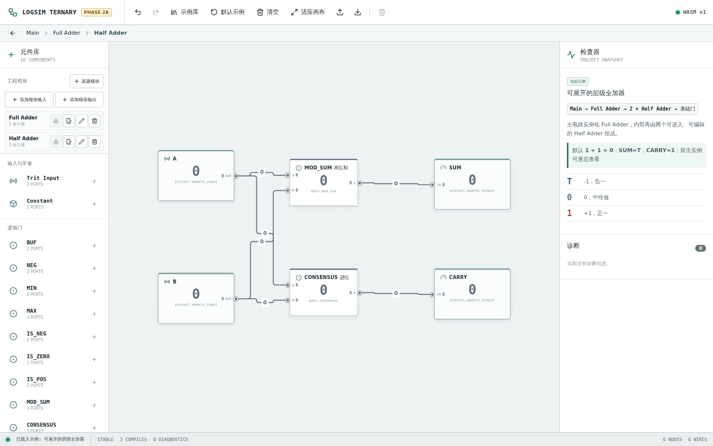
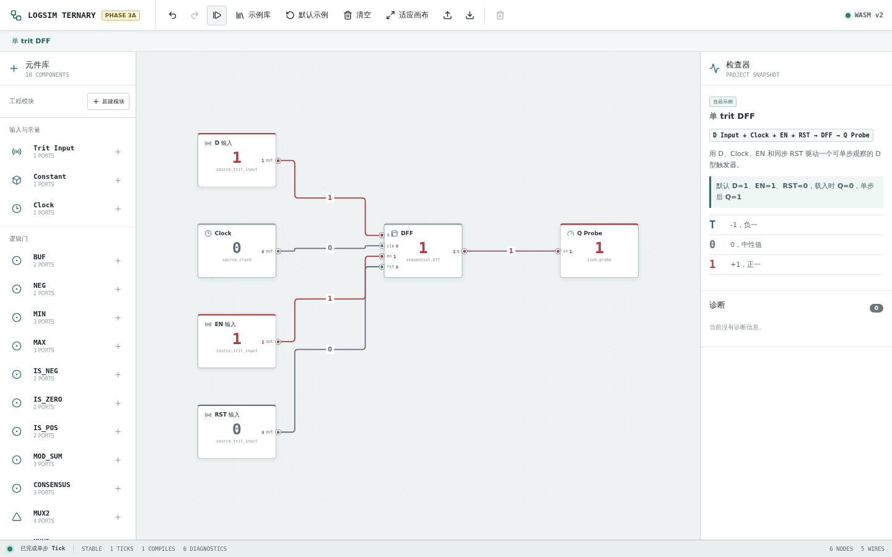
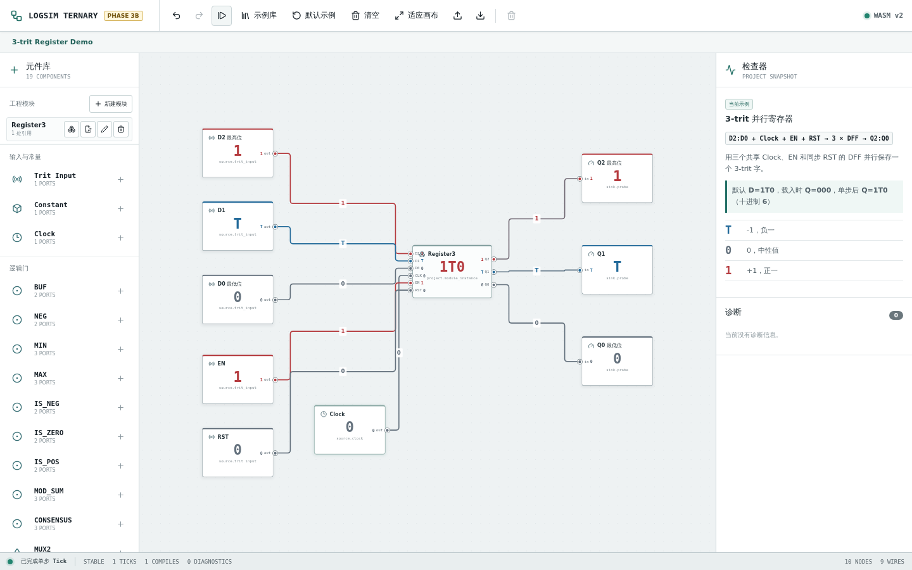

# TritForge

TritForge 是一个以 Rust/WebAssembly 为仿真内核、在浏览器中设计、组合和观察原生平衡三进制数字逻辑电路的工具。







## 前置环境

- Rust stable，包含 `rustfmt`、`clippy` 和 `wasm32-unknown-unknown` target。
- [`wasm-pack`](https://rustwasm.github.io/wasm-pack/) 0.15 或兼容版本。
- Node.js 24 和 npm 10 或兼容版本。
- Chromium；仅运行浏览器端验收测试时需要，可由 Playwright 自动安装。

## 当前能力

- 从元件库拖放或点击添加三进制门，连接输出端与输入端并实时求值。
- 使用字符和颜色同时显示 `T/0/1/X/Z/E`，查看真值表和结构化诊断。
- 撤销、重做、删除、清空、适应画布，并载入可编辑教学示例。
- 新建可复用模块，使用固定 ID 的 `Module Input` 与 `Module Output` 定义接口。
- 重复放置模块实例，支持多层无环嵌套，并通过双击和面包屑进入或返回定义。
- 使用 `1..27` trit 总线、Splitter、Junction 和同名 Tunnel 组织大规模连线。
- 旋转元件、选择导线，并使用避让节点和交叉桥的正交布线观察网络结构。
- 放置 Clock、DFF、Register、ROM 和 RAM；通过单步或自动时钟运行时序电路。
- 使用 Chronogram 记录标量和总线波形，并在平衡三进制、十进制和分隔 trit 间切换显示。
- 载入半加器、全加器、层级加法器、计数器、寄存器、总线和存储器等可编辑示例。
- 导入和导出 Project v3 工程；旧版 v1/v2 文件会在载入时迁移到当前模型。
- 在桌面三栏工作台和窄屏抽屉布局中编辑同一电路。

## 层级模块

左侧“工程模块”区域用于新建、重命名、编辑、放置和删除模块。进入模块定义后，
先添加 `Module Input` 与 `Module Output`，再用基础门连接内部逻辑。边界元件的
`portId` 是外部连线使用的固定 handle；修改显示名称不会断线。

双击模块实例进入它的共享定义。面包屑保存当前实例路径和各层画布视口，同一
模块的多个实例始终引用一份定义。已被外部连线使用的端口和仍有实例引用的模块
不能删除，界面会列出保护原因与使用位置。递归引用在导入和 Rust 校验阶段都会
被拒绝。

工程文件统一导出为 `version: 3`，顶层包含 `rootCircuitId` 与多个 `circuits`。
v1/v2 迁移保留原元件、连线、属性、位置和 viewport，不在 TypeScript 中猜测或
重写门语义。

从仓库根目录安装 Rust 组件、WASM 工具和 Web 依赖：

```bash
rustup toolchain install stable --profile minimal --component rustfmt clippy --target wasm32-unknown-unknown
cargo install wasm-pack --locked
npm ci --prefix apps/web
```

## 构建

构建 Rust workspace：

```bash
cargo build --workspace
```

构建可部署的 Web 应用：

```bash
npm --prefix apps/web run build
```

Web 构建脚本会先把 `crates/sim-wasm` 编译到 `apps/web/src/wasm/pkg`，再运行 TypeScript 检查和 Vite 生产构建；输出位于 `apps/web/dist`。

## 测试

完整检查与 CI 使用同一组命令：

```bash
cargo fmt --all -- --check
cargo clippy --workspace --all-targets -- -D warnings
cargo test --workspace
wasm-pack test --node crates/sim-wasm
npm ci --prefix apps/web
npm --prefix apps/web test
npm --prefix apps/web run build
npm --prefix apps/web exec -- playwright install --with-deps chromium
npm --prefix apps/web run test:e2e
```

## 本地运行

```bash
npm ci --prefix apps/web
npm --prefix apps/web run dev
```

开发服务器默认位于 <http://localhost:5173/>。`dev` 脚本会在启动 Vite 前重新构建 WASM 包。

## 六状态信号

每条导线只承载一个 trit。`T/0/1` 是平衡三进制的三个已知值，`X/Z/E` 用于表达仿真状态：

| 状态 | 含义 |
|---|---|
| `T` | 已知值 `-1` |
| `0` | 已知值 `0` |
| `1` | 已知值 `+1` |
| `X` | 未知值；输入无法确定时使用 |
| `Z` | 高阻或当前没有有效驱动 |
| `E` | 错误；例如不同已知值同时驱动同一网络，或组合传播不收敛 |

普通门会把 `Z` 输入归一为 `X`。网络解析会忽略高阻驱动、聚合全部驱动，并让 `E` 和已知值冲突优先暴露为错误。

## 基础元件

基础目录包含 12 类元件：

- 输入与观察：`Trit Input`、`Constant`、`Probe`。
- 一元门：`BUF`、`NEG`、`IS_NEG`、`IS_ZERO`、`IS_POS`。
- 二元门：`MIN`、`MAX`。
- 选择器：`MUX2`、`MUX3`。

另外提供 `MOD_SUM`、`CONSENSUS`、`Half Adder` 和 `Full Adder`。层级示例使用
基础门构造 Half Adder，再用两个共享 Half Adder 组成 Full Adder；全部 27 组
`A/B/CIN` 已知输入均由真实 Rust/WASM 层级仿真验证。

## 单 trit 时序逻辑

元件库“时序”分组提供 `Clock` 与 `DFF`。点击工具栏“单步 Tick”会完成一次
`CLK: 0 → 1 → 0`，所有 DFF 在同一上升沿读取旧状态并同时提交新 `Q`，因此
结果不依赖元件 ID 或遍历顺序。网页在周期结束后显示稳定快照，所以 Clock
通常仍显示为 `0`。

DFF 端口为 `d/clk/en/rst/q`。`rst=1` 优先同步清零，`en=1` 捕获 `d`，控制值
`T/0` 表示未断言。运行状态只存在于仿真会话中：普通输入更新保留状态，活动
结构重编译、切换活动根或重新载入工程会恢复 `Q=0` 和 `0 TICKS`。示例库中的
“单 trit DFF”可以直接编辑和单步运行。

## 3-trit 并行寄存器

示例库中的“3-trit 并行寄存器”不是新的内建元件，而是一个普通工程
模块。双击 `Register3` 实例可以看到 `dff-2/dff-1/dff-0` 三个 DFF；它们分别
保存 `Q2/Q1/Q0`，共享同一组 `CLK/EN/RST`，所以在一个上升沿并行更新。

三位字按 `Q2Q1Q0` 书写，`Q2` 是最高位，数值为
`9 × Q2 + 3 × Q1 + Q0`，已知值范围是 `-13..13`。例如 `1T0` 表示
`9 - 3 + 0 = 6`。默认示例的 `D=1T0`、初始 `Q=000`，单步一次后得到
`Q=1T0`；`EN=T/0` 时保持，`RST=1` 时在下一次 Tick 同步清零。

模块中央显示的三字符字只是把 Rust/WASM 快照中的 `q2/q1/q0` 依次拼接，三个
Probe 和内部 DFF 才是可检查的逐 trit 信号与状态来源。

## 架构

```text
┌─────────────────────────────────────────────────────────┐
│ React + TypeScript + React Flow                         │
│ 元件库、活动画布、模块管理、层级导航、诊断与工程状态    │
└──────────────────────────┬──────────────────────────────┘
                           │ Project v3、活动根、输入命令与投影快照
┌──────────────────────────▼──────────────────────────────┐
│ sim-wasm                                                │
│ 项目级 simulator、wasm-bindgen API、serde 与结构化错误  │
└──────────────────────────┬──────────────────────────────┘
                           │ Rust 类型与调用
┌──────────────────────────▼──────────────────────────────┐
│ sim-core                                                │
│ 工程校验、层次展开、六状态网络、delta-cycle 与时序 tick │
└─────────────────────────────────────────────────────────┘
```

Rust 是工程校验、层次展开、trit、门逻辑、网络解析和 DFF 状态的唯一语义来源。编译器把
当前活动电路可达的模块确定性展开为基础元件，再把信号与诊断投影回当前层级；
连续输入变化只更新展开后的 source，不重新编译结构。TypeScript 负责编辑器
交互和快照呈现，不维护第二套门求值逻辑。

浏览器安全上限为：最大层次深度 32、展开基础元件 10,000、展开连接 50,000、
projection 端点 100,000。超限工程会在分配完整展开图前返回结构化
`HIERARCHY_EXPANSION_LIMIT` 诊断。

## 归属与许可

本项目参考了 [Logisim-evolution](https://github.com/logisim-evolution/logisim-evolution) 在值对象、元件类型与实例分离、网络解析、事件传播和振荡检测方面的架构思想。Logisim-evolution 由其贡献者开发并以 GNU General Public License version 3 发布；相关名称、原始代码及版权归原项目和各自权利人所有。

TritForge 是面向原生三进制语义的独立 Rust/React 实现，不是 Logisim-evolution 的官方项目，也不直接移植其 Java/Swing 实现。本仓库同样以 GNU General Public License version 3 发布，完整条款见 [LICENSE](LICENSE)。

## 当前不做

- 物理传播延迟和多时钟域时序分析。
- 内建移位寄存器、多端口寄存器组、完整 ALU 或 CPU；这些仍可通过现有基础元件逐层搭建。
- 递归模块、参数化模块和模块接口版本管理。
- 框选电路后一键封装为模块。
- Logisim `.circ` 文件或其他 HDL 的导入。
- HDL 综合、FPGA 下载、SPICE 或晶体管级模拟。
- 模拟电压、连续时间、器件功耗和噪声容限建模。
- 后端服务、用户系统、多用户协作和插件市场。
