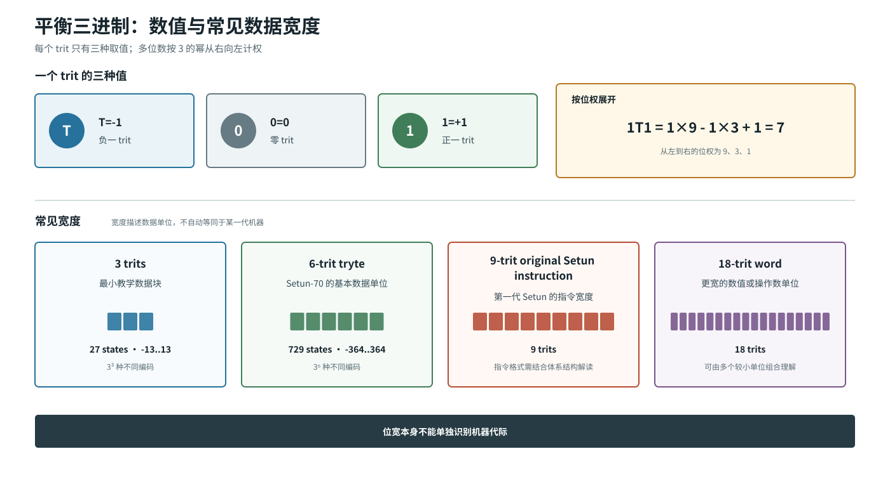
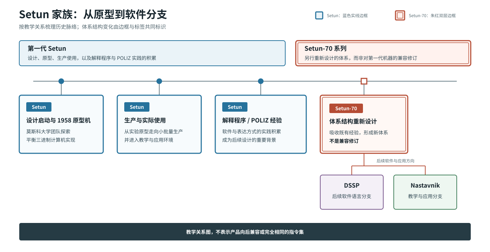
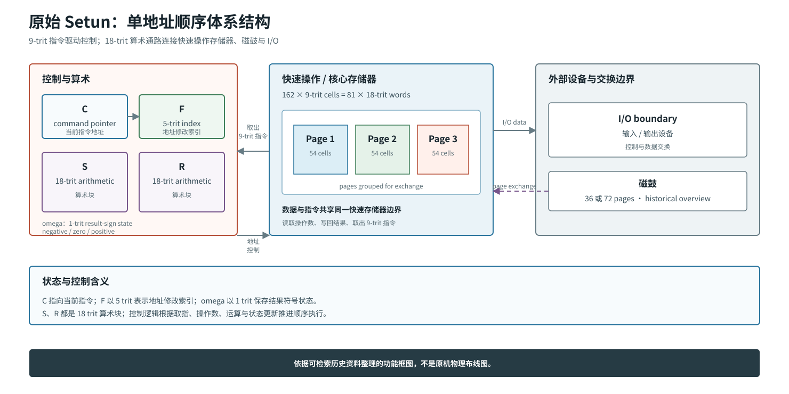
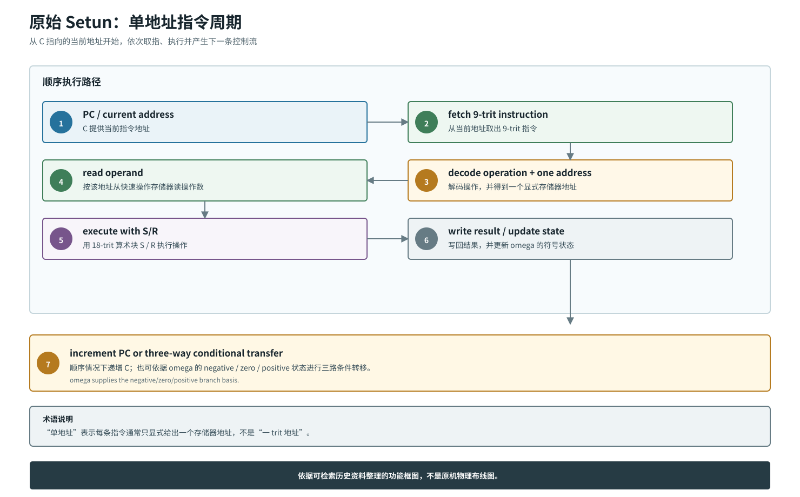
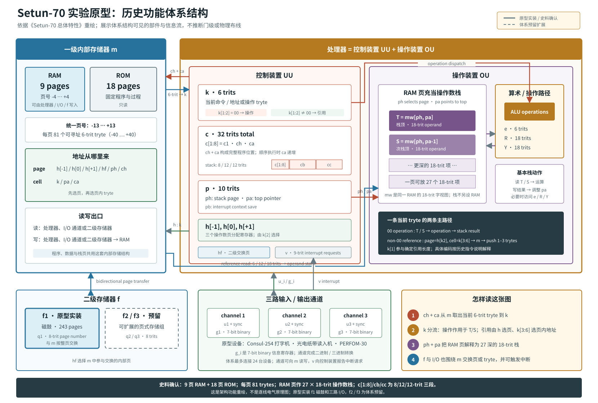
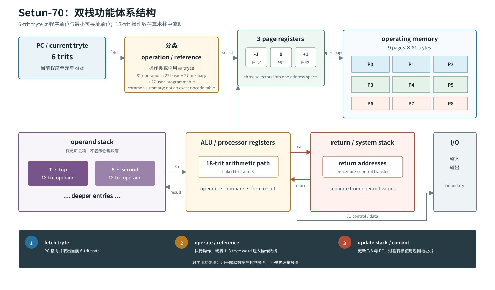
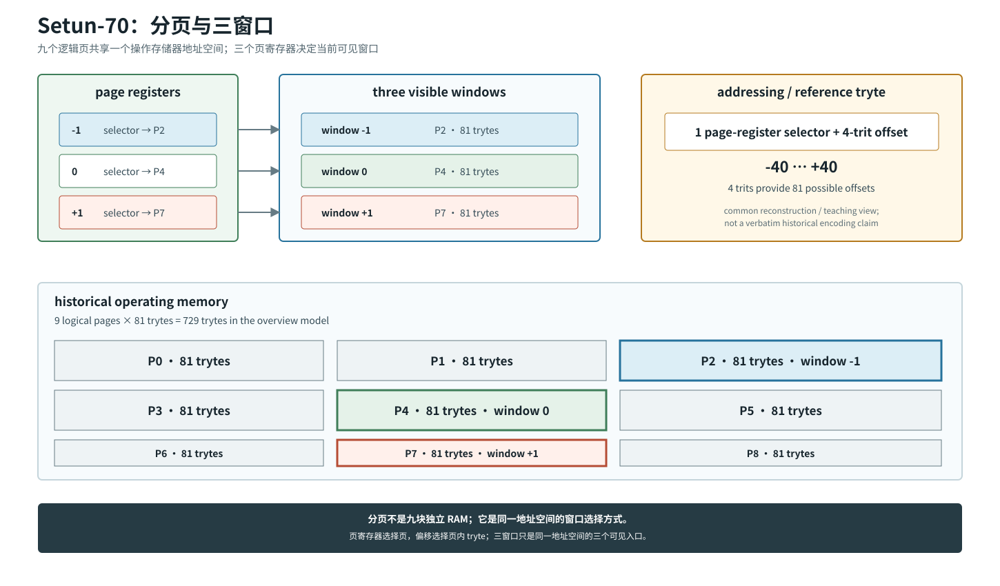
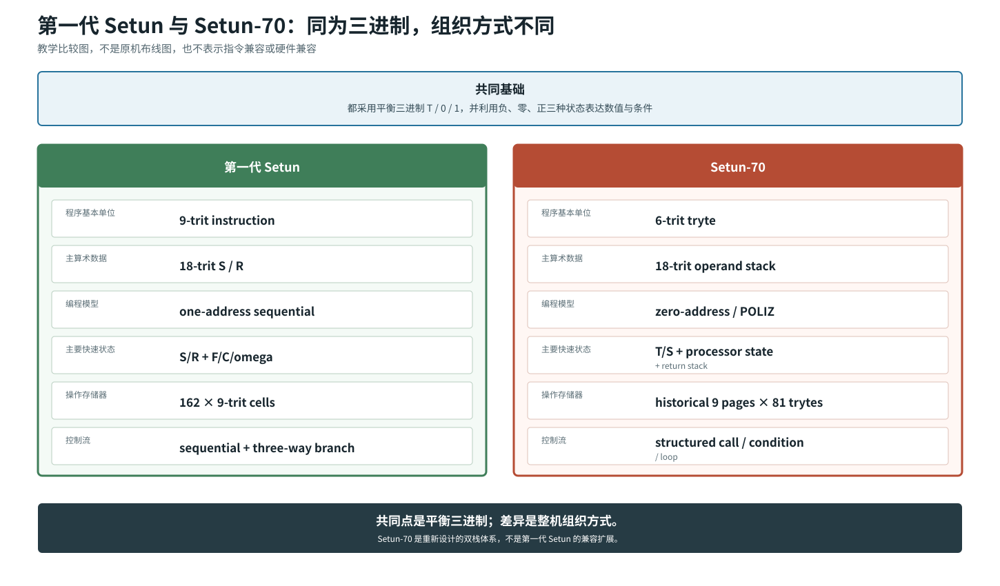

# Setun 系列计算机架构入门

这是一份面向计算机组成学习者的解释型导读。读者只需知道寄存器、ALU、
程序计数器、栈和存储器的基本概念，不需要预先了解三进制计算机。

本文始终区分三种证据：

- **历史资料**：用于说明两代机器的时代、结构和已知规格。
- **教学简化**：用于把资料中的结构拆成现代读者熟悉的数据通路，不声称是
  原机布线或逐时钟复现。
- **模拟器实现**：用于学习和实验，但实现选择不能反推成历史事实。

## 1. 先给读者一张地图

“Setun 系列”不是一套保持指令兼容、逐代扩展的处理器产品线。本文讨论的
两个核心对象是：

1. **第一代 Setun**：9-trit 单地址顺序机器，以 18-trit `S/R` 算术寄存器
   为中心。
2. **Setun-70**：6-trit tryte、18-trit 操作数栈和独立返回栈组成的双栈
   机器，程序组织面向 POLIZ 和结构化控制。

两者都使用平衡三进制，但指令宽度、程序模型、快速状态和控制流组织都不同。
因此，学习时应把它们看作共享数制思想、前后存在经验联系的两套体系结构，
而不是同一 ISA 的旧版和新版。

推荐阅读路线如下：

- 想先读懂数值：看第 2 节。
- 想理解第一代机器：看第 4、5 节。
- 想理解 Setun-70：看第 6 至 11 节。
- 想做现代硬件：重点看第 12 至 14 节。
- 想快速查术语或消除误解：看第 15 节。

## 2. 平衡三进制：T、0、1

### 2.1 一个 trit 表示什么

平衡三进制的每一位称为一个 **trit**。本文采用以下写法：

| 符号 | 数值 |
|---|---:|
| `T` | `-1` |
| `0` | `0` |
| `1` | `+1` |

对一个从低位到高位依次为 \(t_0,t_1,\ldots,t_{n-1}\) 的 n-trit 数，
其值为：

\[
V=\sum_{i=0}^{n-1}t_i3^i,\qquad t_i\in\{-1,0,+1\}
\]

例如：

```text
1T1 = 1*3^2 + (-1)*3^1 + 1*3^0
    = 9 - 3 + 1
    = 7
```

所以 `1T1=7`。这里的 `T` 是一个数位，不是负号或变量名。

### 2.2 n trit 的状态数和范围

n 个 trit 有 \(3^n\) 种状态。平衡表示以 0 为中心，最大绝对值为：

\[
M_n=\sum_{i=0}^{n-1}3^i=\frac{3^n-1}{2}
\]

因此范围是：

\[
-\frac{3^n-1}{2}\ \le V \le\ \frac{3^n-1}{2}
\]

常用宽度如下：

| 宽度 | 状态数 | 范围 |
|---:|---:|---:|
| 1 trit | 3 | `-1..+1` |
| 3 trits | 27 | `-13..+13` |
| 4 trits | 81 | `-40..+40` |
| 6 trits | 729 | `-364..+364` |
| 9 trits | 19683 | `-9841..+9841` |
| 18 trits | \(3^{18}\) | 对称的定宽范围 |

### 2.3 取负为什么简单

平衡三进制数取负时，只需逐位交换 `1` 和 `T`，`0` 保持不变：

```text
  1T1 =  7
  T1T = -7
```

用公式看，每个 \(t_i\) 都变成 \(-t_i\)，整个加权和自然变成 \(-V\)。
这是一条数值性质。具体硬件是否用逐 trit 反相器实现，还取决于器件接口和
时序设计。



## 3. 家族历史：从莫斯科大学实验到软件分支

1956 年初，在苏联莫斯科国立大学（MSU）的计算中心，电子学部门在
S. L. Sobolev 推动下成立。这个背景不必神秘化：当时计算设备昂贵，
大学团队正在探索适合科研、教学和实际计算的实现路线，平衡三进制是其中
一条认真尝试的技术方向。

到 1958 年底，团队完成并投入使用第一代 Setun 原型。随后，机器获得了
程序系统和应用软件，经历测试，并进入生产和实际使用。现有材料能确认它
不只是纸面设计，也服务过大学、工业和研究环境；本文不采用互相矛盾或来源
不清的生产数量说法。

第一代 Setun 上的解释程序、数学软件和 POLIZ 实践积累了重要经验。
在 1967 至 1969 年间，团队据此设计 Setun-70；其实验原型于 1970 年
4 月投入工作。这里的“70”对应新的设计阶段，而不是把旧机指令简单扩宽。

Setun-70 的双栈和结构化程序思想后来延伸到 **DSSP**（结构化程序设计
对话系统）。机器及其程序组织也成为 **Nastavnik** 教学系统的基础之一。
这两条后续路线主要说明架构思想进入了软件与教学实践，不意味着后来的
二进制主机在物理上复制了 Setun-70。



## 4. 第一代 Setun：单地址顺序机器

### 4.1 主要状态

第一代 Setun 可以概括为一台以寄存器算术块为中心的单地址顺序机器：

| 部件 | 宽度或规模 | 作用 |
|---|---:|---|
| 指令 | 9 trits | 给出操作与单个显式地址 |
| `S` | 18 trits | 主算术寄存器或累加相关状态 |
| `R` | 18 trits | 与乘法、扩展算术相关的寄存器 |
| `F` | 5 trits | 地址修改用索引寄存器 |
| `C` | 指令指针 | 指向当前或下一条待执行指令 |
| `omega`（ω） | 1 trit | 保存结果的负、零、正符号，控制三路条件转移 |

“单地址”表示一条指令通常只显式给出一个存储地址，另一个操作数和结果位置
由 `S/R` 等机器状态隐含。它不同于 Setun-70 的零地址栈式执行，也不同于
现代三寄存器指令。

### 4.2 操作存储器和磁鼓

快速操作存储器有 **162 个 9-trit 单元**。同一容量也可按 18-trit 数据
理解为：

```text
162 × 9 trits = 81 × 18 trits
```

为了与外部磁鼓整页交换，它组织为 **3 页 × 54 个 9-trit 单元**。
磁鼓资料给出 36 页或 72 页两种容量。这里要分清三个概念：

- `162 × 9` 是操作存储器的物理容量表述。
- `81 × 18` 是把相邻半字合成 18-trit 数据后的等价容量视图。
- `3 × 54` 是页面交换组织，不是三块互不相干的 RAM。

9-trit 读写与 18-trit 读写都服务于指令和数据处理。磁鼓提供更大的页面
空间，而当前正在计算的内容驻留在较快的操作存储器中。

### 4.3 用 `ADD X` 理解单地址

下面的 `ADD X` 只是**非 opcode 的教学示例**，用于解释单地址数据流，
不是对原机助记符、编码或精确微操作的声明：

```text
假设执行前：S = 5，M[X] = 2
教学语义：  S <- S + M[X]
执行后：    S = 7，omega = positive
```

这里 `X` 是唯一显式地址，`S` 是隐含输入和结果位置。若某条真实指令允许
索引修改，`F` 会参与形成有效地址；是否写回存储器则由实际操作决定。



## 5. 第一代 Setun 的七步指令周期

为了建立数据通路直觉，可以把一条指令的工作拆成七步：

1. **给出指令地址**：`C` 指向当前 9-trit 指令。
2. **取指**：操作存储器把指令送入控制和译码路径。
3. **译码**：识别操作类型及单个显式地址字段。
4. **形成有效地址**：需要地址修改时，结合 5-trit `F`。
5. **读取操作数**：按操作需要读取 9-trit 半字或 18-trit 数据。
6. **执行与写回**：`S/R` 完成算术或数据传递，必要时写回存储器，并更新
   `omega` 的负、零、正状态。
7. **更新控制**：普通指令令 `C` 顺序前进；条件转移依据 `omega` 选择
   负、零、正路径之一。

这七步是面向现代读者的教学简化，不是原机七个固定时钟或微码周期的断言。
它的价值在于说明地址、存储器、算术寄存器和控制状态如何协作。



## 6. 为什么 Setun-70 要重新设计

第一代 Setun 的单地址机器并非“失败后被替换”。它已经支持实际计算，
也形成了解释程序和应用软件生态。重新设计的动力来自使用经验：

- POLIZ 后缀表达式在第一代 Setun 上工作良好。
- 解释系统需要紧凑的程序单元和容易扩展的操作集合。
- 过程调用、条件执行和循环若能直接匹配结构化程序，程序组织会更清楚。
- 让常用操作数自然停留在栈顶，可以减少反复书写显式地址。

因此 Setun-70 没有继续围绕 `S/R + 单地址指令` 小修小补，而是把
**6-trit 程序单元、18-trit 操作数栈、独立返回栈和分页窗口**组合成
新的体系结构。这是从解释程序和 POLIZ 实践反推整机组织方式的设计。

### 6.1 先把 Setun-70 想成五个部分

第一次看 Setun-70 时，先不要急着记字段和操作编号。把机器想成下面五个
协作部分即可：

| 部分 | 暂时把它理解成什么 | 主要保存或处理什么 |
|---|---|---|
| 程序控制 | “下一步看哪里” | 当前程序位置、当前 6-trit tryte 和控制状态 |
| 操作存储器与页窗口 | “程序和数据放在哪里” | 6-trit 单元，以及当前可以短地址访问的页面 |
| 操作数栈 | “算术工作台” | 18-trit 数值、地址和中间结果，顶部可见为 `T/S` |
| 运算与操作分派 | “现在要做什么” | 加减、比较、栈动作、过程或系统操作 |
| 返回栈 | “做完以后回哪里” | 过程返回地址和相关控制上下文 |

一条程序的基本流动可以先记成：

```text
程序控制给出位置
       |
       v
操作存储器取出一个 6-trit tryte
       |
       v
判断它是“操作”还是“引用”
       |
       +--> 操作：使用栈顶数据执行运算或控制动作
       |
       `--> 引用：从存储器取 1～3 个 tryte，送入操作数栈
```

这里最容易混淆的是：**tryte 不一定等于一条传统意义上的完整指令。**
它既可能表示一个操作，也可能表示一次数据引用。后面的章节会逐步展开。

## 7. Setun-70：6-trit tryte 和双栈

### 7.1 先分清 trit、tryte 和算术数据

Setun-70 把 6-trit **tryte** 作为最小可寻址程序单位。tryte 可以承担
操作或引用角色；主算术对象则是 18-trit 操作数，也就是三个 tryte 的宽度。

先把三种单位放在一起：

| 单位 | 宽度 | 在 Setun-70 中的主要用途 |
|---|---:|---|
| trit | 1 trit | 表示 `-1/0/+1`，也是所有编码的基本数位 |
| tryte | 6 trits | 最小可寻址程序单元，可表示操作或引用 |
| 算术数据 | 18 trits | 操作数栈中的主要数值宽度 |

例如，十进制 `7` 的平衡三进制是 `1T1`。放入 18-trit 操作数位置时，
高位可以补 0：

```text
0000000000000001T1 = 7
```

“18 trits 等于三个 tryte 的宽度”只是在说明数据宽度关系，并不意味着
程序每次都必须连续取三个操作 tryte。引用可以根据需要搬运 1、2 或 3 个
tryte，也就是 6、12 或 18 trits。

### 7.2 `T` 这个符号为什么会有两种含义

资料中有一个很容易让初学者困惑的重名：

- 写在平衡三进制数里面的 `T`，表示一个数位 `-1`，例如 `1T1=7`。
- 写成“栈顶 `T`”时，`T` 是 Setun-70 操作数栈最顶端的可见位置。

两者要靠语境区分。下面这句话同时包含两种含义：

```text
栈顶 T 保存数值 1T1。
```

它的意思是“名为 `T` 的栈顶位置中，保存了平衡三进制数 `1T1`，也就是
十进制 7”。本文在表示栈顶时通常写成反引号形式的 `T`，在数字内部直接
写 `T`。

### 7.3 机器中有哪些核心状态

机器的核心结构包括：

- 6-trit 当前 tryte 和程序控制状态。
- 以 `T`、`S` 表示可见栈顶的 18-trit **操作数栈**。
- 与操作数栈分离的**返回栈**，保存过程返回地址和控制上下文。
- 历史综述中的 **9 页 × 81 trytes** 操作存储器。
- 三个页选择寄存器，对应当前可直接访问的三个分页窗口。

这里的 `T/S` 不是让程序随意编号的两枚通用寄存器。它们表示“当前栈顶”
和“当前次栈顶”。压栈、弹栈和二元运算会自动改变哪个值出现在 `T/S`。

也不要把“独立返回栈”理解成一定有一块外观完全独立的物理 RAM。架构层面
能确定的是：普通算术值和过程返回信息遵循两套不同的栈规则。具体电路怎样
分块、端口多宽，需要更细的原始实现资料才能确定。

### 7.4 81 个操作怎样理解

历史综述把操作空间概括为三组，每组 27 个，共 81 个操作：基本操作、
辅助操作和用户可编程操作。不同重建资料的组名并不完全一致。例如 Fortran
重建使用 `MACRO/BASIC/SPEC` 的分派名称。

因此，稳妥的结论是“81 个位置分成三个 27 项组”。组名和每个位置的精确
历史语义需要按具体资料版本核对，不能把某个重建项目的枚举名直接当成唯一
原机命名。

“81 个操作”也不表示机器内部放了 81 个互相独立的 ALU。一个操作位置
可以由硬件直接完成，也可以进入辅助或可编程过程。对初学者来说，先理解
“当前 tryte 选择哪一种动作”比背完整操作表更重要。

### 7.5 实验原型的部件怎样连接

下面这张“Setun-70 实验原型：历史功能体系结构”按历史总体特性资料重绘。
它把一级内部存储器 `m`、控制装置 `UU`、操作装置 `OU`、二级存储器 `f`
和三路 I/O 放回同一套信息流中。图里的连线表达架构层面的访问与控制关系，
不是逐线电气原理图，也不代表机柜里的实际摆放位置。

看图时先抓住两组完全不同的栈：

- `T/S` 属于操作数栈；这个栈实际借用一级 RAM 的一页，由 `ph/pa` 定位。
- `c[1:8]/cb/cc` 是控制上下文栈的三段，宽度分别为 8/12/12 trits，
  保存宏过程或中断控制状态；它们不是三枚等宽寄存器。

实线框中的 `f1` 磁鼓和三路 I/O 是实验原型的实装部分；虚线 `f2/f3`
表示体系结构允许、但原型没有装上的二级存储扩展。



下一张图进一步省略实现细节，只保留适合第一次学习时使用的双栈心智模型：



## 8. 操作 tryte 与引用 tryte

### 8.1 历史层面的确定内容

在历史描述中，一个 tryte 可以是：

- **操作 tryte**：指出要对操作数栈或处理器状态执行的操作或过程。
- **引用 tryte**：作为操作数，或者发起一次引用，把由 1 至 3 个 tryte
  组成的字从操作存储器送到操作数栈。

这使程序既能用一个短 tryte 表示常用操作，也能按需要引用 6、12 或
18-trit 内容。本文不据此虚构完整 opcode 表。

可以先把两条路径理解成：

| 当前 tryte 的角色 | 它回答的问题 | 常见结果 |
|---|---|---|
| 操作 tryte | “对机器当前状态做什么？” | 加法、比较、栈动作、调用或系统操作 |
| 引用 tryte | “从哪里取多少数据？” | 读取 6/12/18-trit 内容并送到操作数栈 |

### 8.2 一次 tryte 怎样被取出和分流

用现代处理器术语描述，一次处理可以拆成下面几步：

1. 程序控制状态给出当前程序位置。
2. 操作存储器返回该位置的 6-trit 单元。
3. 当前 tryte 被保存到控制和分派路径。
4. 控制逻辑判断它走操作路径还是引用路径。
5. 操作路径选择某个操作；引用路径形成存储地址和读取长度。
6. 动作结束后，程序控制转向下一个 tryte，或者被控制操作改写。

```text
当前程序位置
      |
      v
操作存储器 --> 当前 6-trit tryte
                    |
            +-------+-------+
            |               |
         操作路径         引用路径
            |               |
      读写 T/S 或控制    选窗口、偏移和长度
            |               |
            v               v
      更新机器状态       数据压入操作数栈
```

为了方便后文跟踪，本文使用以下**教学伪指令**：

```text
REF A       引用地址 A 中的数据并压入操作数栈
ADD         取 S 和 T 相加，把结果留在新栈顶
CALL Q      调用位于 Q 的过程
RET         返回调用者
STOP        停止教学程序
```

这些名称用于解释数据流，**不是历史 opcode**、官方助记符或精确 tryte
编码。它们也不声明每个动作在原机上恰好只占一个 tryte。

### 8.3 Fortran 重建中的字段拆分

smaslovski 的 Fortran 重建把当前 6-trit 单元记为 `k`，并提供一种明确
可读的字段拆分：

| 重建字段 | 用途 |
|---|---|
| `k1` | 引用长度相关字段 |
| `k2` | 页面寄存器选择相关字段 |
| `k3` | 操作组或分派类别 |
| `ka` | 4-trit 地址或宏操作相关字段 |
| `ko` | 3-trit 操作号 |

在这份重建中，必须同时看 `k1` 和 `k2`，不能只看 `k1`：

- `k1=0, k2=0`：进入操作分派。
- `k1=0, k2!=0`：进入引用路径，引用 2 个 tryte。

只要已经确定进入引用分支，引用长度才由 `k1 + 2` 得到：

| 引用分支中的 `k1` | 引用长度 | 搬运的数据宽度 |
|---:|---:|---:|
| `-1` | 1 tryte | 6 trits |
| `0` | 2 trytes | 12 trits |
| `+1` | 3 trytes | 18 trits |

所以 `k1=0` 本身有歧义：`k2=0` 时属于操作分派，`k2!=0` 时才表示
2-tryte 引用。

这段字段说明属于 **Fortran 重建的结构化实现证据**。历史资料确认了
操作/引用两类 tryte、1 至 3 tryte 引用和三个页面窗口，但不能仅凭这份
代码断言每一位就是所有原机资料中唯一的编码解释。

## 9. POLIZ 栈跟踪：`3 4 +`

### 9.1 为什么加号写在最后

POLIZ 是后缀形式：操作数先出现，操作随后出现。概念表达式：

```text
3 4 +
```

等价于普通中缀表达式 `3 + 4`。读到 `3` 和 `4` 时先保存它们；读到
`+` 时，机器知道所需的两个操作数已经位于栈顶，因此加法本身不必写两个
寄存器编号或两个内存地址。

### 9.2 T 和 S 会怎样移动

本文把栈画成“左边较深、右边是栈顶”。假设栈中原来还有一个较早的数值
`10`，然后依次压入 `3` 和 `4`：

| 动作 | 整个操作数栈（左深右顶） | `S` | `T` |
|---|---|---:|---:|
| 初始 | `[10]` | 无 | 10 |
| 压入 3 | `[10, 3]` | 10 | 3 |
| 压入 4 | `[10, 3, 4]` | 3 | 4 |
| 执行 ADD | `[10, 7]` | 10 | 7 |

执行 ADD 时，参与运算的是执行前的 `S=3` 和 `T=4`：

```text
result = S + T = 3 + 4 = 7
```

随后两个输入被一个结果替代，所以栈深度减少 1。更早的 `10` 没有参与
本次加法，但因为上面的两个值合并成了一个，它重新成为次栈顶 `S`。

这就是为什么不能把 `T/S` 当作两枚互不相关的寄存器。它们是观察栈顶的
两个窗口，栈动作会自动改变窗口中看到的值。

### 9.3 完整教学程序：从两个引用到一次加法

下面用一段教学程序把程序控制、存储器、引用、操作数栈和 ALU 串起来。
假设操作存储器中有：

```text
程序位置 U0：REF A
程序位置 U1：REF B
程序位置 U2：ADD
程序位置 U3：STOP

数据位置 A：3
数据位置 B：4
```

这是一种**教学布局**。`REF/ADD/STOP` 都是教学伪指令，不是历史 opcode；
地址的真实 tryte 编码也在这里省略。

完整状态变化如下：

| 步骤 | 当前程序位置 | 取出的角色 | 发生的数据流 | 操作数栈 |
|---:|---|---|---|---|
| 0 | `U0` | 尚未取指 | 初始状态 | `[]` |
| 1 | `U0` | 引用 A | 读取 A 中的 3，压栈 | `[3]`，`T=3` |
| 2 | `U1` | 引用 B | 读取 B 中的 4，压栈 | `[3,4]`，`S=3,T=4` |
| 3 | `U2` | 操作 ADD | ALU 计算 `S+T`，两个输入变成一个结果 | `[7]`，`T=7` |
| 4 | `U3` | 操作 STOP | 停止教学程序 | `[7]` |

ADD 的概念栈效果可以写成：

```text
( a b -- a+b )
```

这里 `b` 是执行前的 `T`，`a` 是执行前的 `S`。这只是 POLIZ 和栈效果
教学，不是 Setun-70 的精确机器编码，也没有声称“push 3”在原机中必然只
占一个 tryte。

执行完以后：

- 数据位置 A 和 B 没有被修改。
- 程序位置 U0 至 U3 没有被修改。
- 操作数栈从空变成 `[7]`。
- 返回栈完全没有参与，因为程序没有调用过程。
- `7` 的平衡三进制是 `1T1`，放进 18-trit 栈位置时高位补 0。

## 10. 操作数栈、返回栈与三路条件

### 10.1 两个栈不能混为一谈

| 栈 | 保存什么 | 典型动作 |
|---|---|---|
| 操作数栈 | 数值、地址、计算中间结果 | 引用、加减、比较、栈操作 |
| 返回栈 | 过程返回地址和相关控制状态 | call、return、控制转移 |

把返回地址放到独立栈，过程调用就不会与普通算术值争用同一个栈顶。结构化
调用、按条件调用和循环也更容易形成稳定的嵌套关系。

### 10.2 返回栈怎样完成一次调用

假设主程序当前位置是 `P0`：

```text
P0：CALL Q0
P1：下一条主程序操作

Q0：过程的第一步
Q1：RET
```

执行 `CALL Q0` 时，机器至少要解决两个问题：

1. 下一步转到过程入口 `Q0`。
2. 过程结束后记得回到 `P1`。

第二个问题由返回栈解决：

| 时刻 | 程序控制位置 | 返回栈（左深右顶） | 操作数栈 |
|---|---|---|---|
| 调用前 | `P0` | `[]` | 保留原有算术数据 |
| 执行 CALL | 转向 `Q0` | `[P1]` | 不必压入返回地址 |
| 过程执行中 | `Q0...Q1` | `[P1]` | 过程可以正常计算 |
| 执行 RET | 从栈顶取出 `P1` | `[]` | 算术结果仍按过程规则保留 |
| 返回后 | `P1` | `[]` | 主程序继续 |

实际历史机器保存的控制上下文可能不只一个抽象的 `P1`。这个例子只说明
双栈架构最重要的语义：**返回信息进入返回栈，普通数值进入操作数栈。**
如果把 `P1` 压进操作数栈，过程中的加减和栈操作就可能误碰返回地址。

### 10.3 三路条件

一个平衡 trit 正好可表达：

```text
T -> negative
0 -> zero
1 -> positive
```

第一代 Setun 用 `omega` 支持按结果符号的三路条件转移。Setun-70 的
重建资料中也能看到按小于、等于、大于选择控制路径的操作，例如 Fortran
实现里的 `CLT/CET/CGT`。这些助记符属于重建命名；架构层面的重点是
“负、零、正”三种条件是一等状态，而不是先压成单个真假位。

例如，教学上可以把一次比较的结果理解为一个三值条件：

| 比较结果 | 条件 trit | 可选择的控制路径 |
|---|---:|---|
| 左值小于右值 | `T` / `-1` | negative / less 路径 |
| 两值相等 | `0` | zero / equal 路径 |
| 左值大于右值 | `1` / `+1` | positive / greater 路径 |

这不表示所有条件操作都必须把一个独立 trit 写进同一个固定寄存器，而是说明
机器的控制组织可以直接保留三种结果，不必先压缩成“真/假”两种。

## 11. 分页窗口：九页中为什么只看三页

### 11.1 先看完整容量

历史综述给出的 Setun-70 操作存储器是 9 页，每页 81 trytes。页内需要
81 个位置，恰好可由 4 trits 表示：

\[
3^4=81,\qquad offset\in[-40,+40]
\]

总容量是：

```text
9 pages × 81 trytes/page = 729 trytes
```

“9 页”描述同一个操作存储器地址空间的组织方式，不是九种不同类型的内存。
每个页面都可以看成一排 81 个 6-trit 存储位置。

### 11.2 三个页窗口做什么

机器设置三个页寄存器，把当前使用的三个逻辑页面映射到 `-1/0/+1`
三个选择位置。一次引用先选择一个页窗口，再用 4-trit 偏移选择页内
tryte。

只开放三个窗口的意义是用短引用表达当前工作集，不必在每次访问中携带完整
页号。页寄存器改变后，同一个窗口选择值可以指向另一页。

**分页窗口不是三块或九块独立 RAM。** 九页属于同一操作存储器地址空间；
三个窗口只是当下可直接引用的三个入口。图中的具体 `P2/P4/P7` 映射是
教学示例，不是固定启动值。

可以把地址形成过程写成：

```text
窗口选择 trit (-1/0/+1)
          |
          v
读取对应的页寄存器，得到当前页号
          |
          +---- 与 4-trit 页内偏移组合
          |
          v
得到“哪一页、页内哪一个 tryte”
```

### 11.3 分页地址翻译示例

假设三个页寄存器当前保存：

| 窗口选择 | 页寄存器内容 | 当前看到的页面 |
|---:|---|---|
| `-1` | `P2` | 第 2 页 |
| `0` | `P4` | 第 4 页 |
| `+1` | `P7` | 第 7 页 |

现在某次教学引用给出：

```text
窗口选择 = 0
页内偏移 = +5
```

地址翻译分两步：

```text
选择 0 窗口  -> 查页寄存器 -> 得到 P4
页内偏移 +5 -> 在 P4 中选择位置 +5

最终访问：P4[+5]
```

如果之后把 `0` 窗口对应的页寄存器改为 `P6`，同样的短引用：

```text
窗口选择 = 0
页内偏移 = +5
```

就会访问 `P6[+5]`。改变的是短引用的页面解释，不是把同一个地址同时连到
两块 RAM。

### 11.4 为什么不让每条引用直接写完整页号

程序在一小段时间内通常反复访问少数几个页面。让三个页寄存器保存当前工作
页面后，常用引用只需选择 `-1/0/+1` 中的一个窗口，再给出页内偏移。
这样可以缩短频繁出现的地址信息。

当程序需要另一个页面时，可以改变页寄存器；如果内容尚未进入操作存储器，
还涉及与更慢存储之间的页面调入。现有资料不足以让本文把这个过程写成确定
的逐时钟微操作，因此这里只解释架构可见的窗口行为。

一次普通分页引用会改变或使用：

- 使用当前页寄存器完成地址翻译。
- 从目标页面读取 1～3 个 tryte。
- 把读取结果送入操作数栈。

它通常不会因为“读取”本身就修改：

- 目标存储单元的原始内容。
- 另外两个页窗口的映射。
- 返回栈。



## 12. 两代机器与现代寄存器机

### 12.1 两代 Setun 的直接比较



第一代 Setun 和 Setun-70 的共同点是平衡三进制，差异则是整机组织方式：

| 维度 | 第一代 Setun | Setun-70 |
|---|---|---|
| 程序单位 | 9-trit 指令 | 6-trit tryte |
| 主算术数据 | 18-trit `S/R` | 18-trit 操作数栈 |
| 编程模型 | 单地址、顺序执行 | 零地址、POLIZ 栈式执行 |
| 快速状态 | `S/R + F/C/omega` | `T/S + 处理器状态 + 返回栈` |
| 操作存储器 | `162 × 9-trit` 单元 | 历史摘要为 `9 × 81 trytes` |
| 控制流 | 顺序前进与三路条件转移 | 结构化调用、条件与循环 |

### 12.2 与现代寄存器机的区别

以 RISC-V 风格的通用寄存器机为参照：

| 问题 | 第一代 Setun | Setun-70 | RISC-V 风格寄存器机 |
|---|---|---|---|
| 操作数在哪里 | 一个显式地址加 `S/R` 隐含状态 | 默认在操作数栈顶 `T/S` | 通用寄存器堆 |
| 指令怎样指明操作数 | 单地址字段 | 多数算术操作为零地址 | 常显式给出 `rd/rs1/rs2` |
| 中间值怎样保存 | 算术寄存器或存储器 | 留在栈中 | 命名寄存器 |
| 过程返回地址 | 由机器控制机制管理 | 独立返回栈 | 常用链接寄存器和软件栈 |
| 条件 | `omega` 的负、零、正 | 三路条件与栈式控制 | 比较、分支或状态组合 |

因此，不能把 Setun-70 的 `T/S` 当作两枚普通通用寄存器。它们表示栈的
可见顶部，并隐含 push、pop 和深层栈移动。反过来，RISC-V 风格指令中的
寄存器编号是程序显式选择的，不会自动具有栈深度语义。

## 13. 映射到硬件模块

历史结构可以映射为现代 RTL 设计者熟悉的模块，但这种映射服务于理解，
不等于复原原机电路。

| 架构概念 | 可实现的硬件模块 | 第一版应关注什么 |
|---|---|---|
| `PC` / `C` | 程序计数器 | 顺序加一、装载目标、复位值 |
| 当前指令 | `IR` 指令寄存器 | 第一代为 9 trits；Setun-70 教学机可用 6 trits |
| 算术 | `ALU` | 先做定宽 ADD、SUB、NEG、CMP |
| `T/S` | 两级栈顶寄存器加 stack RAM | 明确 push/pop、空栈和溢出 |
| 操作数栈 | 栈指针、`T/S`、更深层 RAM | 不用无限软件列表冒充硬件 |
| 返回栈 | 独立 return stack RAM 和指针 | CALL/RET 与数据栈隔离 |
| 指令过程 | 控制 `FSM` | FETCH、DECODE、READ、EXECUTE、WRITEBACK |
| 操作存储器 | RAM 或 ROM/RAM 组合 | 固定宽度、同步读延迟、容量边界 |
| 页面寄存器 | 三个 page registers | 把窗口选择映射到逻辑页 |
| 条件状态 | 1-trit 或编码后的 condition register | 保留负、零、正三态 |
| 外设边界 | `I/O` 寄存器和握手逻辑 | 先做最小可观察输入输出 |

### 13.1 一条教学指令怎样穿过模块

以一个最小栈式 ADD 为例：

1. `PC` 向操作存储器给出地址。
2. 存储器返回 6-trit 单元，`IR` 锁存。
3. `FSM` 译码为 ADD。
4. `ALU` 读取 `S` 和 `T`。
5. ALU 产生定宽和及负、零、正状态。
6. 栈控制弹出两个值、压入结果，新的结果成为 `T`。
7. `PC` 和 `FSM` 进入下一条指令。

真实同步 RAM 可能让取指、读栈和写回跨多个时钟。Python 模拟器的一次
`step()` 不能直接等同于一个硬件时钟。

### 13.2 第一台原型应该主动缩小范围

第一台三进制硬件原型不应盲目复刻全部 Setun-70。完整设计还涉及
18-trit 数据通路、1 至 3 tryte 引用、分页、双栈、81 个操作位置、
ROM 宏操作、外存、I/O 和中断。把这些一次搬进 RTL，会同时放大编码、
时序和验证风险。

更可靠的次序是：

1. 冻结 `T/0/1` 的物理或 RTL 接口。
2. 验证 1-trit 组合与时序单元。
3. 完成小宽度寄存器、ADD、SUB、NEG、CMP。
4. 用有限 `T/S`、小 ROM、PC 和 FSM 跑通 `3 4 +`。
5. 再逐项加入深栈、返回栈、条件、分页和更宽数据。

这是受 Setun-70 启发的教学处理器路线，不应标注为历史兼容实现。

## 14. 历史机器与模拟器的边界

本仓库及本地资料涉及两种重建。它们适合不同学习目的：

| 对象 | 存储组织 | 数值与栈 | 可以相信到什么程度 |
|---|---|---|---|
| 历史资料中的 Setun-70 | **9 页 × 81 trytes** | 18-trit 操作数、双栈 | 用于架构概念和历史摘要 |
| smaslovski Fortran 重建 | **27 页 × 81** 个 6-trit syllable；同存储可看成每页 27 个 18-trit word | 定宽 trit 数组，`T/S` 映射到主存栈 | 结构上更接近资料，仍非周期精确或最终权威 |
| Zaneham Python 模拟器 | **27 页 × 81** 个教学单元的容量模型 | Python 任意精度整数、列表栈 | 适合快速体验 POLIZ 和简化 ISA |

### 14.1 Python 实现为什么不能直接当硬件规格

当前 Python 模拟器存在几个有意的教学选择：

- 算术使用 Python 任意精度整数，不自然产生固定 3、6 或 18 trit 溢出。
- 操作数栈和返回栈使用列表，不具有物理深度、端口或同步读写延迟。
- 控制流采用自定义地址打包，例如以普通整数组合页和偏移。
- 指令集合是项目自定义简化，不覆盖历史 27+27+27 操作体系。
- 一次 Python `step()` 可以完成硬件中需要多个时钟的工作。

因此，它可以回答“这个教学程序的栈如何变化”，不能单独回答“历史机器每个
trit 怎样连线”或“RTL 在第几个时钟写回”。

### 14.2 Fortran 重建为什么仍不是 golden RTL

Fortran 项目保留了明确 trit 数组、6/18-trit 双视图、主存栈、页面寄存器、
基本/特殊/宏操作框架、I/O 和中断，结构上比 Python 教学机更接近历史材料。
但它仍有边界：

- 代码来自历史算法描述的 OCR 和人工整理。
- 宿主整数、OpenMP 和系统调用不对应门级或同步 RTL 时序。
- 外存寻页过程在当前实现中并不完整。
- 缺少覆盖全部操作和边界的自动化黄金测试。

所以它是很有价值的“可执行结构档案”，不是无需交叉核对的 golden RTL。
历史 **9×81** 与两个重建中的 **27×81** 差异应明确保留，不能为了叙述
整齐而擅自消解。

## 15. 术语表、常见问题与本地阅读

### 15.1 术语表

| 术语 | 含义 |
|---|---|
| trit | 一个三值数位，本文取 `T/0/1 = -1/0/+1` |
| balanced ternary | 平衡三进制，数位以 0 为中心对称 |
| tryte | Setun-70 的 6-trit 最小可寻址程序单位 |
| word | 本文语境中常指 18-trit 主算术数据 |
| POLIZ | 逆波兰或后缀表达形式，先写操作数再写操作 |
| 单地址机器 | 指令显式给一个地址，其他操作数位置由机器状态隐含 |
| 零地址机器 | 算术指令不显式写操作数地址，默认使用栈顶 |
| `S/R` | 第一代 Setun 的 18-trit 算术寄存器 |
| `F` | 第一代 Setun 的 5-trit 地址修改寄存器 |
| `C` | 第一代 Setun 的指令执行指针 |
| `omega` | 第一代 Setun 的 1-trit 结果符号状态 |
| `T/S` | Setun-70 操作数栈的栈顶和次栈顶 |
| 操作数栈 | 保存数据和计算中间结果的栈 |
| 返回栈 | 保存过程返回地址和控制上下文的独立栈 |
| 分页窗口 | 通过页寄存器选择当前可直接引用逻辑页的机制 |
| FSM | 控制取指、译码、执行和写回的有限状态机 |

### 15.2 常见问题

#### 第一代 Setun 和 Setun-70 是同一套架构吗？

不是。它们共享平衡三进制和历史经验，但前者是 9-trit 单地址顺序机器，
后者是 6-trit tryte 的零地址双栈机器。

#### `T` 是字母还是负号？

在数字 `1T1` 中，`T` 是表示 `-1` 的 trit 字符。在“栈顶 `T`”中，
`T` 是 Setun-70 对操作数栈顶部位置的命名。两者只是重名，需要根据数字
语境或栈语境区分。

#### 每个 6-trit tryte 都是一条完整指令吗？

不是。历史描述中的 tryte 可以走操作路径，也可以走引用路径。操作 tryte
选择机器动作；引用 tryte 从操作存储器取得 1～3 个 tryte 的内容并送入
操作数栈。因此不能简单套用“一个 tryte 等于一个现代 CPU 指令”的概念。

#### 6-trit tryte 就等于现代 8-bit byte 吗？

两者都可作为较小的可寻址程序单位，但状态数、编码和机器语义不同。
6 trits 有 729 种状态，不能把它当成 8-bit byte 的换名。

#### `T/S` 是两枚通用寄存器吗？

不是。它们是操作数栈的可见顶部。执行 push、pop 或二元运算时，深层栈和
`T/S` 的关系会自动变化。

#### 为什么资料有 9 页和 27 页两种说法？

历史综述明确给出 9 页 × 81 trytes；smaslovski 与 Zaneham 重建采用
27 页 × 81。两种口径描述的对象不同，当前资料不足以把重建容量改写成
历史原机容量，因此本文并列保留。

#### 三个分页窗口是不是三块 RAM？

不是。它们是同一操作存储器地址空间的三个当前入口。页寄存器决定每个入口
此刻映射到哪一页。

#### 能否把 Python 模拟器输出直接作为 RTL 的溢出答案？

不能。Python 整数没有固定 trit 宽度。RTL 必须先定义宽度、溢出、截断或
异常规则，再用独立定宽参考模型验证。

#### 第一版硬件是否应该实现全部 Setun-70？

不应该。先验证 trit 接口、寄存器、小 ALU、有限栈、PC、IR 和 FSM，
再依据测试结果逐步加入返回栈、条件和分页。

### 15.3 延伸阅读

以下仓库内资料可继续交叉阅读：

1. [相关论文资料综合分析报告](../research/setun-literature-analysis.md)：
   资料分级、Setun/Setun-70 差异、硬件路线和历史口径。
2. [smaslovski Setun70 项目分析报告](../research/smaslovski-setun70-analysis.md)：
   Fortran 重建的定宽 trit、主存双视图、T/S、引用和操作分派。
3. [Zaneham Python 版 Setun70 指令集架构学习文档](../research/zaneham-setun70-isa-guide.md)：
   教学模拟器的栈效果、简化 ISA、地址打包和硬件边界。
阅读这些资料时，最重要的判断规则仍是：先问一句“这是历史资料、教学简化，
还是某个模拟器实现？”只要对象没有混淆，Setun 系列的三进制数值、单地址
机器、双栈机器和现代 RTL 映射就会形成一条清楚的学习路径。
